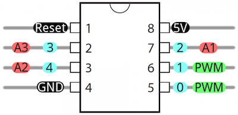

# AtTiny85-Arduino-Serial-Monitor

Serial interface for ATTiny that allows you to print different data types to an arduino's serial monitor. Doesn't require any extra serial cables/devices. This uses Software Serial so it's not all too lightweight.

## Setting up

These instructions assume you are already able to upload code to your ATTiny using the Arduino IDE. For a good tutorial on how to do that check out [this](https://create.arduino.cc/projecthub/arjun/programming-attiny85-with-arduino-uno-afb829).

### Installation
- Download [this zip file](https://github.com/davidOSUL/AtTiny85-Arduino-Serial-Monitor/raw/master/AtTiny85-Arduino-Serial-Monitor.zip)
(also avaialble in releases tab). 

- Using Arduino IDE 1.0.x:
  - **Sketch > Import Library... > Add Library... >** select the downloaded file **> Open**
- Using Arduino IDE 1.5+:
  - **Sketch > Include Library > Add ZIP Library... >** select the downloaded file **> Open**

## Using the Library
- The code uploaded to your Tiny will allow you to write out data
- You'll also have to upload some code to your Arduino to be able to print out incomming data from the Tiny to the Serial Monitor

### Setting up the Arduino
1. Navigate to: **File > Examples > AtTiny85-Arduino-Serial-Monitor > ArduinoSerialInCode**.   
2. Upload this code to your Arduino. 
  
If all you are doing with this arduino is serial monitoring, you won't have to change this code.

### Writing Tiny Code that makes use of Serial
1. Upload code to your Tiny
   - To see examples of code you can upload to your tiny:
     - **File > Examples > AtTiny85-Arduino-Serial-Monitor > ExplicitWrites**   
     - **File > Examples > AtTiny85-Arduino-Serial-Monitor > ImplicitWrites**    

For more details on using these functions see [**TinySerialOut Details**](https://github.com/davidOSUL/AtTiny85-Arduino-Serial-Monitor/blob/master/README.md#tinyserialout-details) below.

### Wiring
Once you've uploaded your code to your Tiny, and the provided code to your arduino, you'll need to connect the two.


Essentially you'll want to hook up your designated TX pin on your Tiny to the Arduino's RX Pin with a 330 ohm resistor in series. Then hook up the Tiny's Voltage pin to 5V and GND to GND.


This library uses one way communication (Tiny -> Arduino), so it only needs one pin on the Tiny for serial communication.   
The schematic shown uses the same pin numbers as used in the included examples, but any of the digital pins should work.       
### Putting everything together: Reading Serial Data
Once you've uploaded the correct code to your arduino as described in [**Setting Up the Arduino**](https://github.com/davidOSUL/AtTiny85-Arduino-Serial-Monitor#setting-up-the-arduino), and you've uploaded code 
to your Tiny that contains some serial output, and wired everything together:
1. Power on the Arduino
2. Make sure that you have the port (**Tools > Port**) corresponding to the Arduino selected
3. **Wait a second or two**. if you open up the Serial Monitor straight away, you may be met with no output. If you then try
to close it and open it again, most likely you'll get bad values, and you'll have to power off and power back on your arduino.
4. Open up the Serial Monitor and read incoming data from the Tiny!


## Other Notes
### TinySerialOut Details
To write serial data from your Tiny include `TinySerialOut.h` in the code that you upload to your Tiny. Create a new TinySerialOut object, and pass in to the constructor the **digital** pin on the Tiny you are using for serial output. Note that this is not the hardware pin, the number you should use in code should correspond to the light-blue numbers below:


The TinySerialOut object contains two groups of functions to use. 

The first allows you explicity state what type of value you are sending:
```
writeBool
writeChar
writeInt8
writeUnsignedInt8 //same as arduino's byte
writeInt16 //same as arduino's int
writeUnsignedInt16
writeInt32 //same as arduino's long
writeUnsignedInt32
writeFloat
writeArray
writeString //a char array, not the Arduino String object
```
The second just uses an overloaded `write(...)` function, which allows for many different data types, namely:
```
int16_t (int)
int32_t (long)
char array (will be output as a string)
bool
char
```
#### Writing Arrays
The Syntax for writeArray is a bit different than the other functions. It is:
```
writeArray(void * array, SerialTypes::Type type, uint32_t length, bool addFormatting)
```
- The first parameter is the array   
- The second is the type of the element that makes up the array. This is passed in as a value in terms of the SerialType `Type` enum, whose members include:   
```
BOOL 
CHAR 
INT8 
UINT8 
INT16 
UINT16 
INT32 
UINT32 
FLOAT 
```
- The Third paramter is the length of the array in # of elements (**not** total byte size)   

- The fourth paramater is whether or not you want formatting.    
  - A formatted array will be printed out as: "[elem1, elem2, elem3]"   
  - An unformatted array will be printed out as: "elem1elem2elem3"      

For example:   
```
int16_t array[] = {1,2,3,4,5};
writeArray(array, SerialTypes::INT16, 5, true);
output: "[1,2,3,4,5]"
```
#### Writing Strings
The writeString method makes use of the writeArray method. 
Calling:
```
char message[] = "hello";
SerialOut.writeString(message, sizeof(message));
```
is the exact same as:
```
char message[] = "hello";
SerialOut.writeArray(message, SerialType::CHAR, sizeof(message), false);
```
which is also the same as:
```
char message[] = "hello";
SerialOut.write(message, sizeof(message));
```
`sizeof` only works in this instance because chars are one byte.

You may also find it useful to define a macro such as:
```
#define STRING_WRITE(str) (SerialOut.write(str, sizeof(str)))
```

### Defined Delay
The library automatically adds in an 100 ms delay after each message. I found this alleviates 
timing issues that occur when sending multiple messages quickly (in a loop for instance). If you'd like to get rid of this you can open up the `TinySerialOut.h` file and comment out:
```
#define USE_DELAY 
```
You can also try changing the length of this delay by changing the value defined at:
```
#define DELAY 100
```
Depending on your prorgam, you may run into some ssues if you change these values. 
### Excluding Unwanted Functions
Most likely your compiler will optimize away any uncalled functions.  But just in case, you can remove them yourself as well. This may or may not save some space on the code uploaded to your Tiny.

Provided in the `TinySerialOut.h` file are a series of defines that can be commented out to explicitly remove certain functions from compilation. 

For example if you know you won't be outputting any boolean values, you can comment out:
```
#define USE_BOOL`
```
and both the `writeBool(bool out)` function, as well as the `write(bool out)` function will be disabled.

You can also comment out:
```
#define USE_SHORTHAND_FUNCTIONS
```
which will remove all the `write(...)` functions.   

